<!-- ═══════════════════════════════  HEADER  ═══════════════════════════════ -->

<p align="center">
  <a href="https://zaos.dev"></a>
</p>

<p align="center">
  
</p>

<p align="center">
  I build products end to end, from the first commit to the server they run on.<br/>
  I specialise in <b>web &amp; mobile development</b>, <b>3D / VR architectures</b> and <b>deep learning models</b>.
</p>

<p align="center">
  <a href="https://zaos.dev"></a>
  <a href="https://www.linkedin.com/in/juan-manuel-gonz%C3%A1lez-santos-43757b316"></a>
  
</p>

<br/>

<!-- ═══════════════════════════════  ABOUT  ═══════════════════════════════ -->

## 🧑‍💻 About me

```ts
const zaos = {
  name:      "Juan Manuel González Santos",
  role:      ["Full-Stack Software Engineer", "Multimedia Engineer"],
  basedIn:   "Alicante, Spain 🇪🇸 · CET (UTC+1)",
  education: [
    "MSc in Artificial Intelligence · University of Alicante · thesis 10/10",
    "BSc in Multimedia Engineering · University of Alicante · thesis 9/10",
  ],
  currently: "Freelance tech partner and sole engineer behind Vidareal",
  focus:     ["Web & Mobile", "3D / VR (WebXR)", "Deep Learning", "Self-hosted infra"],
  mission:   "Bringing AI into real products that people actually use",
  speaks:    { spanish: "native", english: "B2" },
  openTo:    ["Job offers", "Freelance projects", "Remote roles across Europe 🇪🇺"],
} as const;
```

<br/>

<!-- ═══════════════════════════════  PROJECTS  ═══════════════════════════════ -->

## 🚀 Featured projects

<p align="center">
  <a href="https://vidareal.es"></a>
  
</p>
<p align="center">
  <a href="https://zaos.dev"></a>
  <a href="https://rua.ua.es/entities/publication/ee6fe8af-ed5b-4bf1-a063-3dae75d93c02"></a>
</p>

<br/>

<!-- ═══════════════════════════════  TECH STACK  ═══════════════════════════════ -->

## 🛠️ Tech stack

<table align="center">
  <tr>
    <td align="center" width="210"><b>💻 Languages</b></td>
    <td>
      
      
      
      
    </td>
  </tr>
  <tr>
    <td align="center" width="210"><b>🎨 Frontend &amp; Mobile</b></td>
    <td>
      
      
      
      
      
    </td>
  </tr>
  <tr>
    <td align="center" width="210"><b>🥽 3D &amp; XR</b></td>
    <td>
      
      
      
      
    </td>
  </tr>
  <tr>
    <td align="center" width="210"><b>⚙️ Backend &amp; Data</b></td>
    <td>
      
      
      
      
      
      
      
    </td>
  </tr>
  <tr>
    <td align="center" width="210"><b>🧠 AI &amp; ML</b></td>
    <td>
      
      
      
      
    </td>
  </tr>
  <tr>
    <td align="center" width="210"><b>☁️ Infra &amp; DevOps</b></td>
    <td>
      
      <img src="https://img.shields.io/badge/Dokploy-18181B?style=for-the-badge&logo=data:image/svg%2bxml;base64,PHN2ZyB4bWxucz0iaHR0cDovL3d3dy53My5vcmcvMjAwMC9zdmciIHZpZXdCb3g9IjAgMCA2NCA1OC41Ij48cGF0aCBmaWxsPSJ3aGl0ZSIgZD0iTTQ2LjkgMC41QzQ2LjcgMC44IDQ2LjcgMS4yIDQ2LjggMi4yQzQ2LjkgNC40IDQ4LjMgNy4yIDQ5LjggOC41QzUwLjYgOS4yIDUyLjYgMTAuMiA1My4xIDEwLjJDNTMuNSAxMC4yIDUzLjUgMTAuMyA1Mi44IDExLjRDNTIgMTIuNiA1MC45IDEzLjYgNDkuNSAxNC4xQzQ4IDE0LjYgNDUuMSAxNC43IDQyLjkgMTQuMkM0MC43IDEzLjcgMzkuOCAxMy40IDMyLjUgOS45QzIyLjkgNS4zIDIyLjggNS4yIDIxLjUgNC45QzIwLjQgNC42IDE5LjQgNC41IDEzLjMgNC40QzguNiA0LjMgNi4xIDQuNCA1LjUgNC41QzMuNCA0LjkgMS42IDYuNCAwLjcgOC40QzAuMSA5LjcgLTAuMSAxMi4xIDAgMTYuMUMwLjEgMTguNiAwLjIgMTkuMyAwLjUgMjAuM0MxLjIgMjIuNCAyLjMgMjMuNyA0LjMgMjQuOEMxNi4xIDMwLjkgMTkuOSAzMi41IDI1LjYgMzMuNEMyNy43IDMzLjcgMzMgMzMuNyAzNSAzMy40QzM4IDMzIDQxLjYgMzIgNDQuNiAzMC43QzQ2IDMwLjEgNDkuNiAyOC4xIDUyLjggMjYuMkM1OS44IDIyIDYwLjggMjEuNCA2MS4xIDIwLjVDNjEuNCAxOS42IDYwLjYgMTguMyA1OS42IDE4LjNDNTkuMiAxOC4zIDU5LjMgMTguMyA1NC45IDIwLjlDNDQuMSAyNy41IDQwLjggMjkgMzUuMyAyOS45QzMyIDMwLjUgMjYuMiAzMC4yIDIzIDI5LjRDMTkuNSAyOC40IDE4LjYgMjggMTAuNiAyNC4xQzUuNiAyMS43IDQuNSAyMS4xIDQgMjAuNUMzLjcgMjAuMSAzLjQgMTkuNyAzLjQgMTkuNkMzLjQgMTkuNCA0LjcgMTkuNCA4IDE5LjVMMTIuNiAxOS41TDE0LjUgMjAuM0MxNS42IDIwLjcgMTcuNyAyMS41IDE5LjEgMjIuMkMyMy4yIDI0LjEgMjYuNCAyNC44IDMxIDI0LjhDMzUuMyAyNC44IDM5LjIgMjQgNDMuNiAyMi4zQzQ5LjcgMTkuOCA1NC4xIDE2LjIgNTYuMSAxMS45QzU2LjMgMTEuNCA1Ni41IDExIDU2LjYgMTFDNTYuNiAxMSA1Ny4zIDEwLjkgNTguMSAxMC44QzYwLjEgMTAuNiA2MS42IDkuOSA2MyA4LjVMNjQgNy41VjUuM1YzLjFMNjMuMyAzLjZDNjIuNSA0LjIgNjEuNCA0LjUgNTkuOSA0LjVDNTguNyA0LjUgNTcuMyA1LjEgNTYuNCA2LjJMNTUuNiA3TDU1LjUgNi41QzU1LjIgNS4xIDUzLjcgMy43IDUxLjggM0M1MC4yIDIuNSA0OS41IDIuMSA0OC45IDEuMUM0OC42IDAuNiA0OC4zIDAuMiA0OC4yIDAuMUM0Ny44IC0wLjEgNDcuMiAwIDQ2LjkgMC41Wk0yMC44IDguMkMyMS45IDguNSAyMi44IDguOCAyNS41IDEwLjJDMjYuNCAxMC42IDI4LjMgMTEuNiAyOS44IDEyLjNDMzEuMiAxMyAzMy43IDE0LjEgMzUuMyAxNC45QzQwIDE3LjEgNDEgMTcuNSA0My41IDE3LjhMNDQuOSAxNy45TDQzLjYgMTguNkM0MiAxOS4zIDQwLjcgMTkuOCAzOC41IDIwLjRDMzUuNSAyMS4yIDM0LjQgMjEuMyAzMC45IDIxLjNDMjYuMiAyMS4zIDI0IDIwLjggMjAgMTguOUMxNC4zIDE2LjMgMTQgMTYuMiA4LjEgMTYuMUM0LjYgMTYgMy42IDE1LjkgMy40IDE1LjdDMi44IDE1LjEgMy4xIDEwLjMgMy44IDkuM0M0LjIgOC42IDQuOCA4LjIgNS42IDcuOUM1LjggNy44IDkuMiA3LjggMTIuOSA3LjhDMTguNCA3LjkgMjAgNy45IDIwLjggOC4yWiBNMTIuOCAxMC43QzExLjkgMTEuMSAxMS40IDEyLjIgMTEuOSAxMy4xQzEyLjQgMTQuMSAxMy41IDE0LjMgMTQuMyAxMy42QzE1IDEzIDE1IDExLjkgMTQuNCAxMS4zQzEzLjkgMTAuOCAxMy4yIDEwLjYgMTIuOCAxMC43WiBNMC45IDI1LjRDMC4xIDI1LjggLTAuMSAyNi41IDAgMjguN0MwLjIgMzEuMSAwLjUgMzIuNiAxLjMgMzUuM0M0LjMgNDUuOSAxMS40IDUzLjUgMjEuMyA1Ni45QzI2LjcgNTguOCAzMi44IDU5IDM4IDU3LjVDNDYuNSA1NS4xIDUzLjggNDkgNTcuNiA0MC45QzU5LjYgMzYuNyA2MC45IDMxLjUgNjAuOSAyNy45QzYwLjkgMjYuMSA2MC42IDI1LjUgNTkuOCAyNS4zQzU4LjkgMjUgNTYuNCAyNi40IDUyLjMgMjkuNUM0NS40IDM0LjUgNDIuOCAzNi4xIDM5LjQgMzcuMkMzNi44IDM4LjEgMzUuMSAzOC40IDMyLjMgMzguN0MyNi44IDM5LjEgMjAuOCAzNy44IDE1LjkgMzVDMTQuMSAzNCA4LjYgMzAuMiA1LjkgMjguMUMyLjkgMjUuNyAyLjcgMjUuNiAyIDI1LjRDMS42IDI1LjMgMS4zIDI1LjMgMC45IDI1LjRaTTU3LjUgMzEuMUM1Ny4zIDMxLjggNTcuMiAzMi40IDU3LjIgMzIuNkM1Ny4yIDMyLjggNTYuOSAzMyA1Ni43IDMzLjJDNTYuNCAzMy40IDU1LjUgMzQuMSA1NC42IDM0LjlDNTMuNyAzNS42IDUyLjYgMzYuNiA1Mi4xIDM2LjlDNTEuNiAzNy4zIDUwLjUgMzguMyA0OS42IDM5QzQ3LjYgNDAuOCA0NC42IDQyLjkgNDIuOSA0My44QzQxLjQgNDQuNyAzOC4xIDQ1LjkgMzUuOCA0Ni40QzI4LjggNDcuOCAyMC44IDQ2LjMgMTUuMyA0Mi40QzExLjkgMzkuOSA0LjIgMzMuNSAzLjkgMzIuOUMzLjcgMzIuMiAzLjMgMzAuOCAzLjQgMzAuNkMzLjUgMzAuNSA0LjIgMzEgNS4xIDMxLjdDMTAuNyAzNiAxNS44IDM5LjEgMTkuNyA0MC40QzIzLjYgNDEuNyAyNiA0Mi4xIDMwLjMgNDIuMUMzNC4yIDQyLjEgMzYuNyA0MS44IDQwLjEgNDAuNkM0NCAzOS4zIDQ1LjkgMzguMyA1MS4xIDM0LjVDNTQuNiAzMiA1Ny41IDMwIDU3LjcgMzBDNTcuOCAzMCA1Ny43IDMwLjUgNTcuNSAzMS4xWk01NC45IDM5LjNDNTQuOSAzOS4zIDU0LjggMzkuNyA1NC42IDQwLjFDNTMuOCA0MS43IDUyLjEgNDQuMiA1MC42IDQ1LjdDNDYuNCA1MC4zIDQxLjQgNTMuNCAzNS44IDU0LjZDMzMuNSA1NS4xIDI3LjQgNTUuMSAyNS4xIDU0LjVDMTcuNCA1Mi43IDExLjIgNDguMSA3IDQxLjJDNi42IDQwLjQgNi4yIDM5LjYgNi4yIDM5LjZDNi4yIDM5LjYgNy44IDQwLjggOS44IDQyLjNDMTEuNyA0My44IDEzLjkgNDUuNCAxNC42IDQ1LjlDMjAgNDkuMiAyNC45IDUwLjUgMzEuNiA1MC4zQzM1IDUwLjIgMzcuNCA0OS43IDQwLjUgNDguNkM0NC4xIDQ3LjQgNDYuOCA0NS43IDUxLjkgNDEuNUM1NC41IDM5LjQgNTQuOSAzOSA1NC45IDM5LjNaIi8%2BPC9zdmc%2B" alt="Dokploy"/>
      
      
      
      
      
    </td>
  </tr>
</table>

<br/>

<!-- ═══════════════════════════════  STATS  ═══════════════════════════════ -->

## 📊 GitHub activity

<!-- Cards and snake are regenerated daily by .github/workflows/profile.yml and published to the `output` branch -->
<p align="center">
  
  
</p>

<p align="center">
  
</p>

<p align="center">
  <picture>
    <source media="(prefers-color-scheme: dark)" srcset="https://raw.githubusercontent.com/zaosdev/zaosdev/output/snake-dark.svg"/>
    <source media="(prefers-color-scheme: light)" srcset="https://raw.githubusercontent.com/zaosdev/zaosdev/output/snake.svg"/>
    
  </picture>
</p>

<br/>

<!-- ═══════════════════════════════  OFF THE KEYBOARD  ═══════════════════════════════ -->

## ⚡ Off the keyboard

<p align="center">
  When I'm not shipping code or tuning servers, I'm training <b>Shotokan karate</b> 🥋<br/>
  or back in Raccoon City with <b>Resident Evil</b>, my all-time favourite saga 🧟<br/>
  <sub>I build inventory systems at work, and I still lose hours to inventory Tetris in RE4.</sub>
</p>

<br/>

<p align="center">
  
</p>
